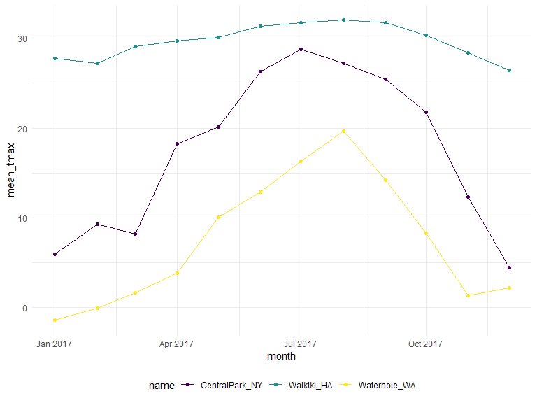
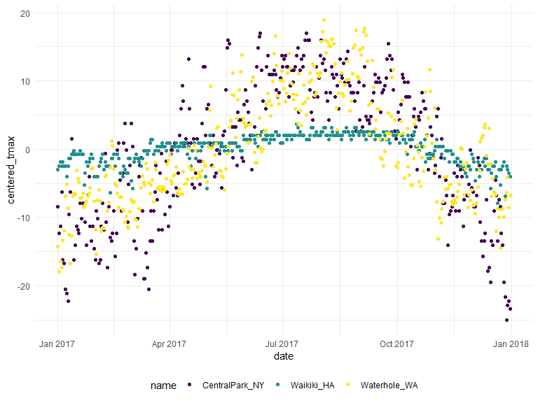

191003\_inclass\_EDA
================
Gavin Ko
10/3/2019

Group\_by is like adding layer on the dataset, be aware.

``` r
weather_df = 
  rnoaa::meteo_pull_monitors(c("USW00094728", "USC00519397", "USS0023B17S"),
                      var = c("PRCP", "TMIN", "TMAX"), 
                      date_min = "2017-01-01",
                      date_max = "2017-12-31") %>%
  mutate(
    name = recode(id, USW00094728 = "CentralPark_NY", 
                      USC00519397 = "Waikiki_HA",
                      USS0023B17S = "Waterhole_WA"),
    tmin = tmin / 10,
    tmax = tmax / 10,
    month = lubridate::floor_date(date, unit = "month")) %>%
  select(name, id, date, month, everything())
```

    ## Registered S3 method overwritten by 'crul':
    ##   method                 from
    ##   as.character.form_file httr

    ## Registered S3 method overwritten by 'hoardr':
    ##   method           from
    ##   print.cache_info httr

    ## file path:          C:\Users\good_\AppData\Local\rnoaa\rnoaa\Cache/ghcnd/USW00094728.dly

    ## file last updated:  2019-09-26 10:26:06

    ## file min/max dates: 1869-01-01 / 2019-09-30

    ## file path:          C:\Users\good_\AppData\Local\rnoaa\rnoaa\Cache/ghcnd/USC00519397.dly

    ## file last updated:  2019-09-26 10:26:22

    ## file min/max dates: 1965-01-01 / 2019-09-30

    ## file path:          C:\Users\good_\AppData\Local\rnoaa\rnoaa\Cache/ghcnd/USS0023B17S.dly

    ## file last updated:  2019-09-26 10:26:28

    ## file min/max dates: 1999-09-01 / 2019-09-30

``` r
weather_df %>%
  group_by(name, month)
```

    ## # A tibble: 1,095 x 7
    ## # Groups:   name, month [36]
    ##    name           id          date       month       prcp  tmax  tmin
    ##    <chr>          <chr>       <date>     <date>     <dbl> <dbl> <dbl>
    ##  1 CentralPark_NY USW00094728 2017-01-01 2017-01-01     0   8.9   4.4
    ##  2 CentralPark_NY USW00094728 2017-01-02 2017-01-01    53   5     2.8
    ##  3 CentralPark_NY USW00094728 2017-01-03 2017-01-01   147   6.1   3.9
    ##  4 CentralPark_NY USW00094728 2017-01-04 2017-01-01     0  11.1   1.1
    ##  5 CentralPark_NY USW00094728 2017-01-05 2017-01-01     0   1.1  -2.7
    ##  6 CentralPark_NY USW00094728 2017-01-06 2017-01-01    13   0.6  -3.8
    ##  7 CentralPark_NY USW00094728 2017-01-07 2017-01-01    81  -3.2  -6.6
    ##  8 CentralPark_NY USW00094728 2017-01-08 2017-01-01     0  -3.8  -8.8
    ##  9 CentralPark_NY USW00094728 2017-01-09 2017-01-01     0  -4.9  -9.9
    ## 10 CentralPark_NY USW00094728 2017-01-10 2017-01-01     0   7.8  -6  
    ## # ... with 1,085 more rows

There’s nothing new, or is there? The group index is on top of the
dataset. When you put weather\_df itself, it doesn’t show the group\_by
layer.

``` r
weather_df %>% 
  group_by(month) %>% 
  summarize(
    n_obs = n(), #create new variable to accomodate existing values
    n_unique = n_distinct(date)) #check distinct value
```

    ## # A tibble: 12 x 3
    ##    month      n_obs n_unique
    ##    <date>     <int>    <int>
    ##  1 2017-01-01    93       31
    ##  2 2017-02-01    84       28
    ##  3 2017-03-01    93       31
    ##  4 2017-04-01    90       30
    ##  5 2017-05-01    93       31
    ##  6 2017-06-01    90       30
    ##  7 2017-07-01    93       31
    ##  8 2017-08-01    93       31
    ##  9 2017-09-01    90       30
    ## 10 2017-10-01    93       31
    ## 11 2017-11-01    90       30
    ## 12 2017-12-01    93       31

You don’t need to do `group_by` and `summarize` every single time. Let’s
use count.

``` r
weather_df %>% 
  count(name, month, name = "n_days") 
```

    ## # A tibble: 36 x 3
    ##    name           month      n_days
    ##    <chr>          <date>      <int>
    ##  1 CentralPark_NY 2017-01-01     31
    ##  2 CentralPark_NY 2017-02-01     28
    ##  3 CentralPark_NY 2017-03-01     31
    ##  4 CentralPark_NY 2017-04-01     30
    ##  5 CentralPark_NY 2017-05-01     31
    ##  6 CentralPark_NY 2017-06-01     30
    ##  7 CentralPark_NY 2017-07-01     31
    ##  8 CentralPark_NY 2017-08-01     31
    ##  9 CentralPark_NY 2017-09-01     30
    ## 10 CentralPark_NY 2017-10-01     31
    ## # ... with 26 more rows

``` r
#bad example of using name: it's a parameter to assign value column names.
```

How do you generate table?

``` r
## don't ever do this
## weather_df %>% 
## pull(name) %>% 
## table() 
## Base R functions are not allowed.
```

``` r
weather_df %>% 
  count(name) %>% 
  knitr::kable()
```

| name            |   n |
| :-------------- | --: |
| CentralPark\_NY | 365 |
| Waikiki\_HA     | 365 |
| Waterhole\_WA   | 365 |

Created 2 x 2 table…

``` r
weather_df %>% 
  filter(name != "Waikiki_HA") %>% 
  mutate(
    cold = case_when( #just as ifelse, just choose what you like.
      tmax < 5 ~ "cold",
      tmax >= 5 ~ "not cold",
      TRUE ~ ""
    )
  ) %>% 
  group_by(name, cold) %>% 
  count() %>% 
  pivot_wider(
    names_from = name,
    values_from = cold
  )
```

    ## # A tibble: 4 x 3
    ##       n CentralPark_NY Waterhole_WA
    ##   <int> <chr>          <chr>       
    ## 1    44 cold           <NA>        
    ## 2   321 not cold       <NA>        
    ## 3   172 <NA>           cold        
    ## 4   193 <NA>           not cold

but it’s 4 x 2, what are you taking about?

``` r
weather_df %>% 
  filter(name != "Waikiki_HA") %>% 
  mutate(
    cold = case_when( 
      tmax < 5 ~ "cold",
      tmax >= 5 ~ "not cold",
      TRUE ~ ""
    )
  ) %>% 
  janitor::tabyl(name, cold) #tabyl package
```

    ##            name cold not cold
    ##  CentralPark_NY   44      321
    ##    Waterhole_WA  172      193

Special note: Jeff is AGAINST 2 x 2 table.

Let’s move on to general summaries.

``` r
weather_df %>% 
  group_by(name, month) %>% 
  summarize(
    n = n(),
    mean_tmax = mean(tmax, na.rm = T),
    sd_tmax = sd(tmax, na.rm = T),
    median_prcp = median(tmax, na.rm = T)
 ) %>% 
  ggplot(aes (x = month, y = mean_tmax, color = name) ) + geom_point() + geom_line()
```



``` r
# Waikiki has NA value because of 3 rows of missing data.
# You cannot take mean of sth doesn't exist.
# Double check before na.rm, see how did the NA's come from
# multiple condition is also allowed
```

This is too complicated. Let’s make it more simple.

``` r
weather_df %>% 
  group_by(name, month) %>% 
  summarize(
    n = n(),
    mean_tmax = mean(tmax, na.rm = T),
 ) %>% 
  pivot_wider(
    names_from = name,
    values_from = mean_tmax
  ) %>% 
  knitr::kable(digits = 1) #rounding
```

| month      |  n | CentralPark\_NY | Waikiki\_HA | Waterhole\_WA |
| :--------- | -: | --------------: | ----------: | ------------: |
| 2017-01-01 | 31 |             6.0 |        27.8 |         \-1.4 |
| 2017-02-01 | 28 |             9.3 |        27.2 |           0.0 |
| 2017-03-01 | 31 |             8.2 |        29.1 |           1.7 |
| 2017-04-01 | 30 |            18.3 |        29.7 |           3.9 |
| 2017-05-01 | 31 |            20.1 |        30.1 |          10.1 |
| 2017-06-01 | 30 |            26.3 |        31.3 |          12.9 |
| 2017-07-01 | 31 |            28.7 |        31.8 |          16.3 |
| 2017-08-01 | 31 |            27.2 |        32.0 |          19.6 |
| 2017-09-01 | 30 |            25.4 |        31.7 |          14.2 |
| 2017-10-01 | 31 |            21.8 |        30.3 |           8.3 |
| 2017-11-01 | 30 |            12.3 |        28.4 |           1.4 |
| 2017-12-01 | 31 |             4.5 |        26.5 |           2.2 |

Don’t forget you can ungroup by using `ungroup()`\!

``` r
weather_df %>% 
  group_by(name) %>% 
  mutate(
    mean_tmax = mean(tmax, na.rm = T), # specific to all value within each group
    centered_tmax = tmax - mean_tmax
  ) %>% 
  ggplot(aes (x = date, y = centered_tmax, color = name)) + geom_point()
```



Window functions in group mutates, talking about rankings.

``` r
weather_df %>% 
  group_by(name, month) %>% 
  mutate(
    tmax_rank = min_rank(tmax) #min rank indicates the smaller comes in the front rank.
  ) %>% 
  filter(tmax_rank == 1)
```

    ## # A tibble: 42 x 8
    ## # Groups:   name, month [36]
    ##    name         id        date       month       prcp  tmax  tmin tmax_rank
    ##    <chr>        <chr>     <date>     <date>     <dbl> <dbl> <dbl>     <int>
    ##  1 CentralPark~ USW00094~ 2017-01-09 2017-01-01     0  -4.9  -9.9         1
    ##  2 CentralPark~ USW00094~ 2017-02-10 2017-02-01     0   0    -7.1         1
    ##  3 CentralPark~ USW00094~ 2017-03-15 2017-03-01     0  -3.2  -6.6         1
    ##  4 CentralPark~ USW00094~ 2017-04-01 2017-04-01     0   8.9   2.8         1
    ##  5 CentralPark~ USW00094~ 2017-05-13 2017-05-01   409  11.7   7.2         1
    ##  6 CentralPark~ USW00094~ 2017-06-06 2017-06-01    15  14.4  11.1         1
    ##  7 CentralPark~ USW00094~ 2017-07-25 2017-07-01     0  21.7  16.7         1
    ##  8 CentralPark~ USW00094~ 2017-08-29 2017-08-01    74  20    16.1         1
    ##  9 CentralPark~ USW00094~ 2017-09-30 2017-09-01     0  18.9  12.2         1
    ## 10 CentralPark~ USW00094~ 2017-10-31 2017-10-01     0  13.9   7.2         1
    ## # ... with 32 more rows

For more information, check `?min_rank` for full set of variables.

Next, let’s check lags and leads. When we want to check the day by day
differences, which location fluctuate the most, …

``` r
weather_df %>% 
  group_by(name) %>% 
  mutate(
    lagged_tmax = lag(tmax), #copy all the information, shift by one row down
    one_day_tmax_change = tmax - lagged_tmax,
    leaded_tmax = lead(tmax) #the opposite of lagging
  ) %>% 
  summarize(
    sd_daily_change = sd(one_day_tmax_change, na.rm = T)
  )
```

    ## # A tibble: 3 x 2
    ##   name           sd_daily_change
    ##   <chr>                    <dbl>
    ## 1 CentralPark_NY            4.45
    ## 2 Waikiki_HA                1.23
    ## 3 Waterhole_WA              3.13

``` r
# don't forget, 'summarize' is not 'summary'
```
